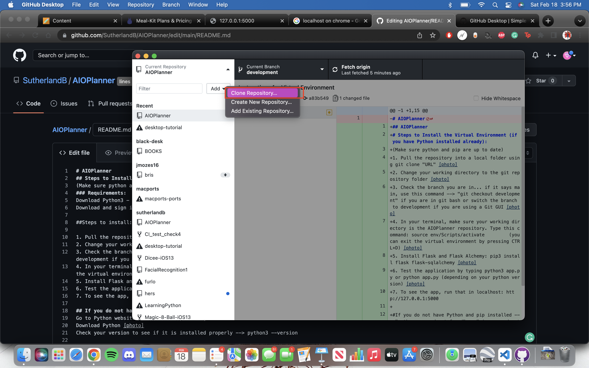
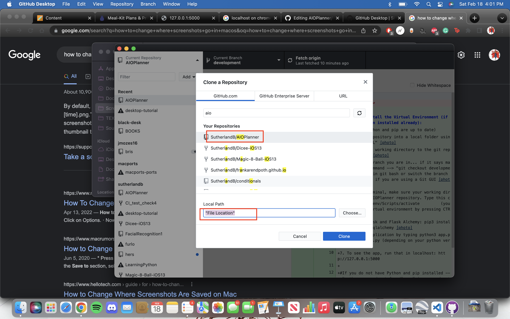
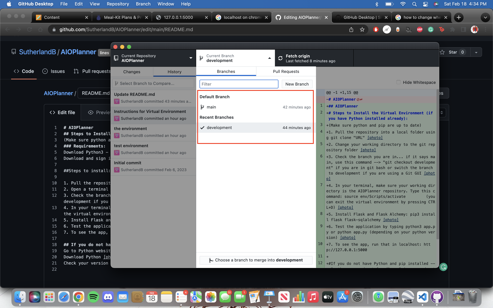

# AIOPlanner
## Steps to Install the Virtual Environment (if you have Python installed already):
(Make sure python and pip are up to date)
### Requirements:
Download Python3 - https://python.org
Download and sign into Github Desktop (easiest to use) - https://desktop.github.com/

##Steps to install:

1. Pull the repository into a local folder using the Clone Repository option  
2. Open a terminal and change your working directory to the git repository folder 
3. Check the branch you are in... if it says main, use this command --> "git checkout development" if you are in git bash or switch the branch to development if you are using a Git GUI 
4. In a terminal, make sure your working directory is the AIOPlanner repository under the development branch(previous step). Type this command: source env/Scripts/activate
5. Install Flask and Flask Alchemy: pip3 install flask flask-sqlalchemy 
6. Test the application by typing python3 app.py or python app.py (depending on your python version) 
7. To see the app in your web browser, run that in localhost: http://127.0.0.1:5000

## If you do not have Python and pip installed --> "python command not found" or "pip command not found":
Go to Python website: https://www.python.org
Download Python [photo]
Check your version to see if it is installed properly --> python3 --version
